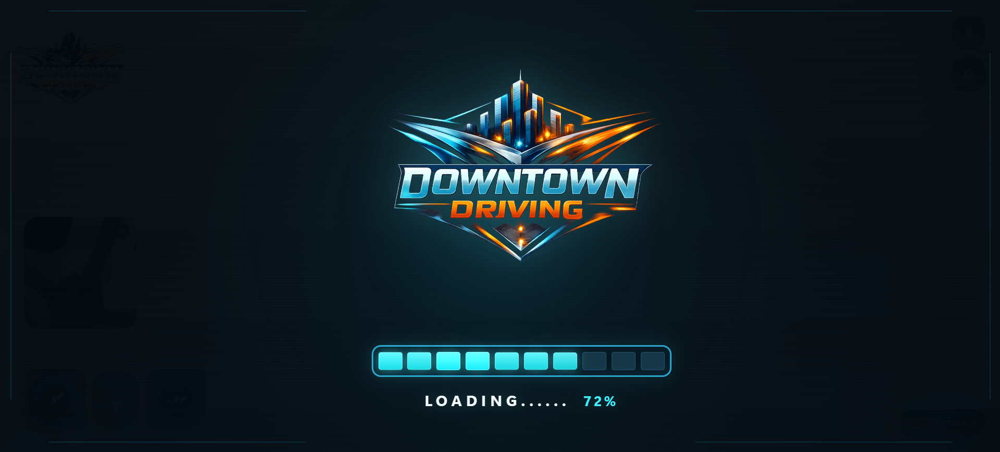
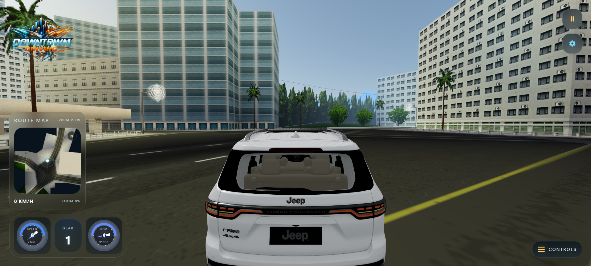
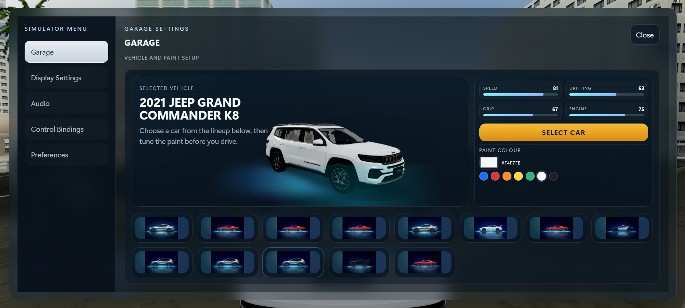
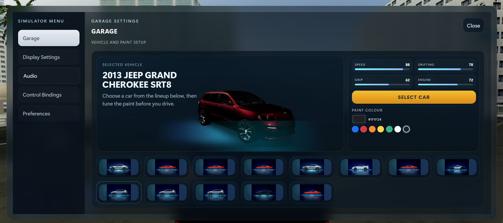
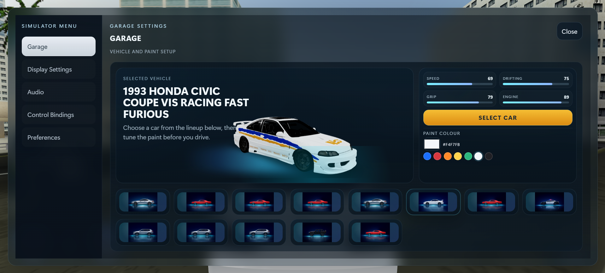
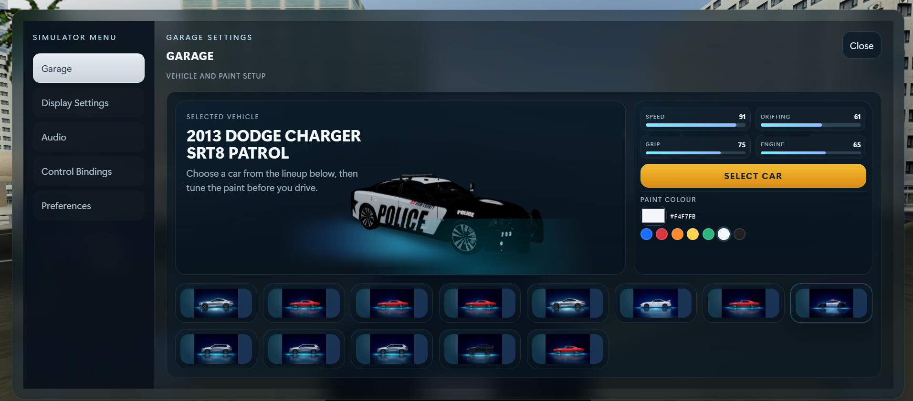
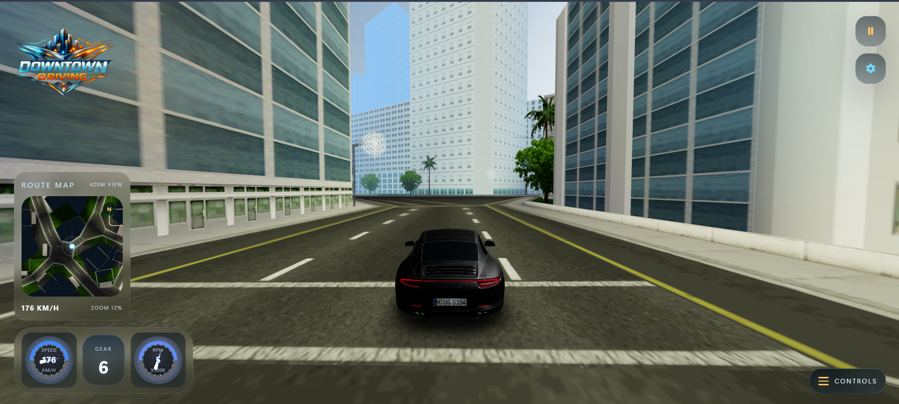
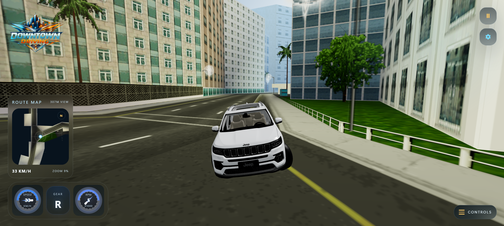

# Metropolis Drive Simulator

React + Vite web app that loads your provided city map and Porsche GLB assets into a playable 3D driving simulator.

## Stack

- React
- Vite
- TypeScript
- three.js
- @react-three/fiber
- @react-three/drei
- zustand

## Run

```bash
npm install
npm run dev
```

## GitHub Pages

Push `main` to GitHub and enable `Settings > Pages > Source: GitHub Actions`.
The included workflow will build and publish this Vite app automatically.

For this repository, the site path is:

```text
https://thimira-hansana.github.io/Open-City-Driver-3D/
```

## Screenshots

### Loading Screen



### Gameplay Views









## Controls

- `W / Arrow Up`: accelerate
- `S / Arrow Down`: reverse
- `A / D / Arrow Left / Arrow Right`: steer
- `Space`: brake
- `Shift`: boost
- `C`: switch camera
- Camera modes: `chase`, `driver`, `dickey`, `overview`
- `R`: reset vehicle
- `H`: toggle controls panel

## Structure

```text
public/assets
  car/
  map/
src
  app/
  entities/
    car/
    environment/
  features/
    simulator/
      components/
      config/
      hooks/
      lib/
      state/
  shared/
    config/
    lib/
    styles/
```
